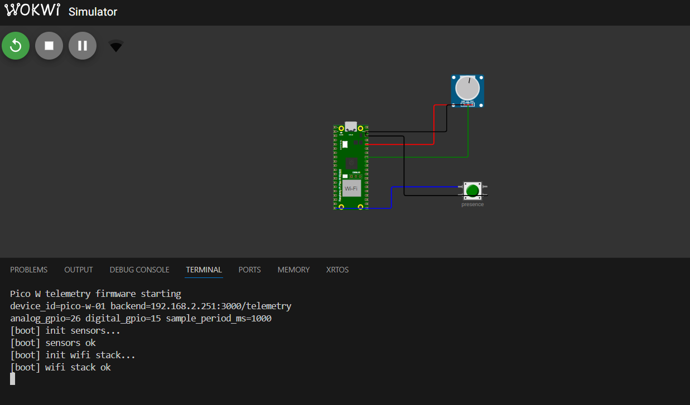
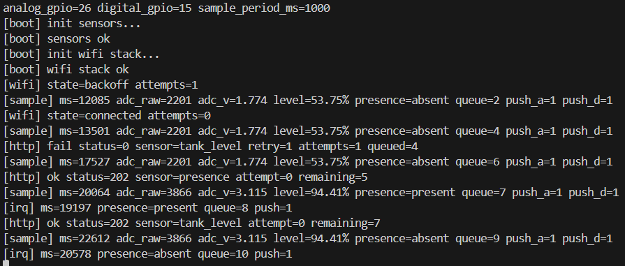
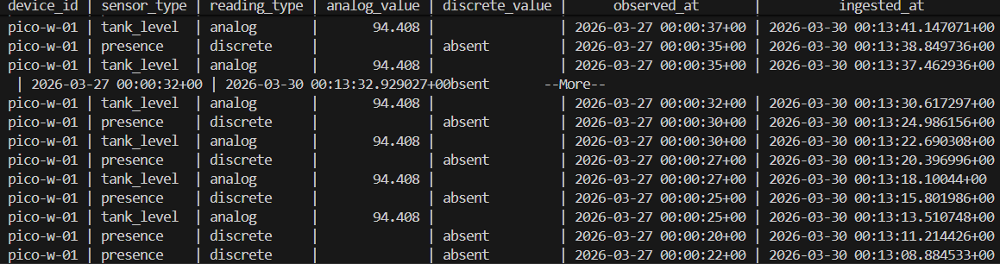

# Firmware Parte 2 - Raspberry Pi Pico W (Toolchain Nativo)

A Parte 2 implementa um firmware embarcado para Raspberry Pi Pico W que simula uma estacao de telemetria industrial: le sensores analogicos e digitais conectados aos GPIOs, gerencia conectividade Wi-Fi com reconexao automatica e envia pacotes HTTP para o backend da Parte 1 no formato esperado. A solucao tambem inclui mecanismos de confiabilidade (fila local, retry e backoff) e validacao completa via simulacao no Wokwi.

Referencia da Parte 1 (backend): usar o backend deste workspace ja em `../` (endpoint `POST /telemetry`) ou apontar para o repositorio remoto equivalente.

Detalhes de referencia: `REFERENCE_PART1.md`.

Metodo oficial de execucao deste projeto: **simulacao no Wokwi (VS Code extension)**.

## Toolchain e arquitetura

- Linguagem: C puro (Pico SDK)
- Build: CMake + `arm-none-eabi-gcc`
- Rede: `pico_cyw43_arch_lwip_threadsafe_background` + lwIP RAW TCP (sem sockets)
- Board alvo: Raspberry Pi Pico W (`PICO_BOARD=pico_w`)

Fluxo:
1. Timer de hardware gera tick periodico (`SENSOR_SAMPLE_PERIOD_MS`) sem bloquear o loop.
2. ADC em modo one-shot le GPIO analogico e converte valor bruto para escala fisica.
3. GPIO digital usa IRQ de borda configurada em registradores `io_bank0` + debounce em firmware.
4. Eventos entram em fila circular local (RAM).
5. Maquina de estados Wi-Fi conecta/reconecta com backoff exponencial.
6. Cliente HTTP custom serializa JSON manualmente e envia para `POST /telemetry` via API RAW do lwIP.
7. Falhas de envio geram retry assincrono com backoff; fila desacopla leitura da transmissao.

## Sensores integrados

| Sensor | Tipo | Pino | Range esperado | Payload |
|---|---|---|---|---|
| Potenciometro/Nivel de tanque simulado | Analogico (ADC) | `GPIO26` (`ADC0`) | `0.0%` a `100.0%` | `sensorType=tank_level`, `readingType=analog`, `unit=%` |
| Botao/Presenca | Digital (IRQ) | `GPIO15` (pull-up interno) | `present` ou `absent` | `sensorType=presence`, `readingType=discrete` |

Como o sistema se comporta na pratica:
- O potenciometro gera uma leitura analogica continua (nivel de 0% a 100%) e o firmware envia esse valor periodicamente.
- O botao representa presenca: pressionado = `present`, solto = `absent`.
- Alem da leitura periodica, mudancas no botao tambem disparam eventos imediatos por interrupcao (IRQ).
- Os dois sensores sao independentes: o botao nao envia o valor do potenciometro.

## Estrutura

- `CMakeLists.txt`: configuracao de build nativa.
- `include/config.h`: SSID, senha, endpoint e parametros de firmware.
- `src/sensors.c`: ADC, GPIO IRQ por registrador, debounce e timer periodico.
- `src/network.c`: maquina de estados Wi-Fi + HTTP POST manual via API RAW TCP do lwIP.
- `src/telemetry.c`: fila circular, retry/backoff, serializacao JSON.
- `src/main.c`: loop principal e integracao dos modulos.
- `simulation/wokwi/`: simulacao de hardware (Wokwi).
- `evidence/`: exemplos de logs e capturas para entrega.

## Compilacao para simulacao (Wokwi)

Pre-requisitos:
- Pico SDK instalado (`PICO_SDK_PATH` configurado)
- `cmake` >= 3.13
- `arm-none-eabi-gcc`
- Extensao Wowki VSCode

### Windows PowerShell

```powershell
cd pico-w-firmware
$env:PICO_SDK_PATH="C:\dev\pico\pico-sdk"
cmake -S . -B build -G "Ninja"
cmake --build build
```

Artefatos usados pela simulacao: `build/pico_w_telemetry.uf2` e `build/pico_w_telemetry.elf`.

## Configuracao de rede e endpoint

Edite `include/config.h`:
- `WIFI_SSID`
- `WIFI_PASSWORD` (WPA2-PSK)
- `BACKEND_HOST` (IP literal da API da Parte 1; ex: `192.168.0.10`)
- `BACKEND_PORT` (padrao `3000`)
- `BACKEND_PATH` (padrao `/telemetry`)
- `TELEMETRY_DEVICE_ID`

Observacao: `TELEMETRY_EPOCH_UNIX` define a base de timestamp UTC usada no payload.

## Compatibilidade com a Parte 1

Payload enviado segue o contrato validado no backend:

```json
{
  "deviceId": "pico-w-01",
  "timestamp": "2026-03-27T12:40:11.000Z",
  "sensorType": "tank_level",
  "readingType": "analog",
  "value": 63.214,
  "unit": "%",
  "metadata": {
    "source": "pico-w",
    "gpio": 26,
    "attempt": 0
  }
}
```

`readingType=discrete` envia `value` como string (`present`/`absent`), compativel com o schema da Parte 1.

## Diagrama de conexao

```text
Raspberry Pi Pico W
-------------------
3V3  ---------------------> Potenciometro VCC
GND  ---------------------> Potenciometro GND
GPIO26/ADC0 <------------- Potenciometro SIG (wiper)

3V3  ---------------------> Botao lado A
GPIO15 <------------------> Botao lado B
GPIO15 --(pull-up interno)--> HIGH em repouso
GPIO15 -----> GND ao pressionar (borda e debounce via IRQ)
```

Arquivos de simulacao (raiz do projeto): `diagram.json` e `wokwi.toml` (copias tambem em `simulation/wokwi/`).

## Simulacao (Wokwi)

1. Abra a pasta `pico-w-firmware` no VS Code e rode "Wokwi: Start Simulator" (usa `diagram.json` + `wokwi.toml` da raiz).
2. Confirme que `build/pico_w_telemetry.uf2` existe (referenciado no `wokwi.toml`).
3. Varie o potenciometro e acione o botao para gerar leituras analogicas/discretas.
4. Observe logs seriais (UART em GP0/GP1 com `$serialMonitor`) e chamadas HTTP para o backend.

## Evidencias de funcionamento

- Logs seriais: `evidence/serial-log-sample.txt`
- Captura de requisicoes HTTP no backend Parte 1: `evidence/backend-http-capture.txt`
- Evidencia visual de simulacao:

**[Print 1 - Simulador Wokwi conectando com Wi-Fi]**


**[Print 2 - Envio automatico dos valores dos Sensores]**


**[Print 3 - Prova de recebimento no Backend]**


## Confiabilidade implementada

- Debounce em firmware para eventos digitais.
- Fila circular de telemetria em RAM.
- Retry assincrono por mensagem com backoff exponencial.
- Maquina de estados de reconexao Wi-Fi.
- Leitura periodica com timer de hardware sem bloquear o fluxo principal.

## Troubleshooting de build

Se ocorrer erro `fatal error: lwip/netdb.h: No such file or directory`
- Causa: submodulo lwIP ausente/incompleto no Pico SDK.
- Solucao no SDK:

```powershell
git -C $env:PICO_SDK_PATH submodule update --init lib/lwip
git -C $env:PICO_SDK_PATH submodule update --init lib/cyw43-driver
```

## Verificacao no backend (Parte 1)

Monitorar API e worker:

```powershell
docker compose logs -f api
docker compose logs -f worker
```

Contar registros persistidos:

```powershell
docker compose exec postgres psql -U postgres -d telemetry -c "SELECT COUNT(*) FROM telemetry_readings;"
```

Ver ultimas leituras:

```powershell
docker compose exec postgres psql -U postgres -d telemetry -c "SELECT device_id, sensor_type, reading_type, analog_value, discrete_value, observed_at, ingested_at FROM telemetry_readings ORDER BY ingested_at DESC LIMIT 20;"
```

Filtrar somente o Pico:

```powershell
docker compose exec postgres psql -U postgres -d telemetry -c "SELECT device_id, sensor_type, reading_type, analog_value, discrete_value, ingested_at FROM telemetry_readings WHERE device_id='pico-w-01' ORDER BY ingested_at DESC LIMIT 20;"
```